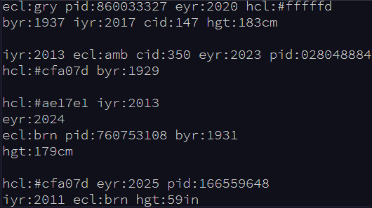
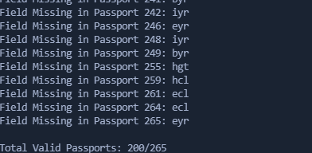
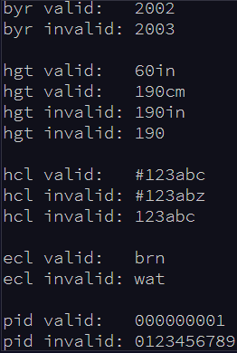
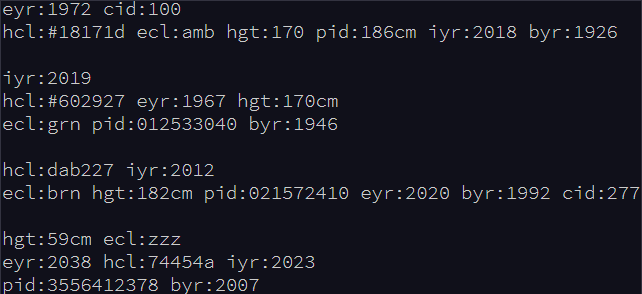
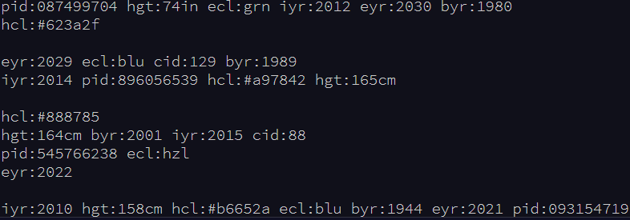
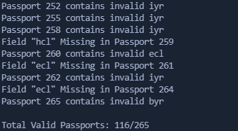

# [--- Day 4: Passport Processing ---](https://adventofcode.com/2020/day/4)  

> You arrive at the airport only to realize that you grabbed your North Pole Credentials instead of your passport. While these documents are extremely similar, North Pole Credentials aren't issued by a country and therefore aren't actually valid documentation for travel in most of the world.   
>
> It seems like you're not the only one having problems, though; a very long line has formed for the automatic passport scanners, and the delay could upset your travel itinerary.   
>  
> Due to some questionable network security, you realize you might be able to solve both of these problems at the same time.  
> 
> The automatic passport scanners are slow because they're having trouble **detecting which passports have all required fields**. The expected fields are as follows:  
>
> - `byr` (Birth Year)  
> - `iyr` (Issue Year)  
> - `eyr` (Expiration Year)  
> - `hgt` (Height)  
> - `hcl` (Hair Color)  
> - `ecl` (Eye Color)  
> - `pid` (Passport ID)  
> - `cid` (Country ID)  
>
> Passport data is validated in batch files (your puzzle input). Each passport is represented as a sequence of `key:value` pairs separated by spaces or newlines. Passports are separated by blank lines.  
>
> Here is an example batch file containing four passports:  
> 
>   
> 
> The first passport is **valid** - all eight fields are present. The second passport is **invalid** - it is missing `hgt` (the Height field).  
> 
> The third passport is interesting; the **only missing field** is `cid`, so it looks like data from North Pole Credentials, not a passport at all! Surely, nobody would mind if you made the system temporarily ignore missing `cid` fields. Treat this "passport" as **valid**.  
> 
> The fourth passport is missing two fields, `cid` and `byr`. Missing `cid` is fine, but missing any other field is not, so this passport is **invalid**.  
> 
> According to the above rules, your improved system would report **2** valid passports.  
> 
> Count the number of **valid** passports - those that have all required fields. Treat `cid` as optional. **In your batch file, how many passports are valid?**  
>
> To begin, [get your puzzle input](https://adventofcode.com/2020/day/4/input).
>
> Answer: **200**

---  

# Solution (Silver Star)  

Run the python scrip _main1.py_ to get the solution given the input file _input.txt_:  
`python3 main1.py`  

---  

# --- Part Two ---  

> The line is moving more quickly now, but you overhear airport security talking about how passports with invalid data are getting through. Better add some data validation, quick!   
> 
> You can continue to ignore the `cid` field, but each other field has strict rules about what values are valid for automatic validation:  
> 
> - `byr` (Birth Year) - four digits; at least `1920` and at most `2002`.   
> - `iyr` (Issue Year) - four digits; at least `2010` and at most `2020`.  
> - `eyr` (Expiration Year) - four digits; at least `2020` and at most `2030`.  
> - `hgt` (Height) - a number followed by either `cm` or `in`:  
> - + If `cm`, the number must be at least `150` and at most `193`.  
> - + If `in`, the number must be at least `59` and at most `76`.  
> - `hcl` (Hair Color) - a `#` followed by exactly six characters `0-9` or `a-f`.  
> - `ecl` (Eye Color) - exactly one of: `amb` `blu` `brn` `gry` `grn` `hzl` `oth`.  
> - `pid` (Passport ID) - a nine-digit number, including leading zeroes.  
> - `cid` (Country ID) - ignored, missing or not.  
> 
> Your job is to count the passports where all required fields are both **present** and **valid** according to the above rules. Here are some example values:  
> 
>   
> 
> Here are some invalid passports:  
> 
>   
> 
> Here are some valid passports:  
> 
>   
> 
> Count the number of **valid** passports - those that have all required fields **and valid values**. Continue to treat `cid` as optional. **In your batch file, how many passports are valid?**   
> 
> Answer: **116**
> 
> Although it hasn't changed, you can still [get your puzzle input](https://adventofcode.com/2020/day/4/input).

---  

# Solution (Gold Star)  

Run the python scrip _main2.py_ to get the solution given the input file _input.txt_:  
`python3 main2.py`  

