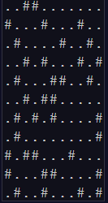

# [--- Day 3: Toboggan Trajectory ---](https://adventofcode.com/2020/day/3)  

> With the toboggan login problems resolved, you set off toward the airport. While travel by toboggan might be easy, it's certainly not safe: there's very minimal steering and the area is covered in trees. You'll need to see which angles will take you near the fewest trees.  
>
> Due to the local geology, trees in this area only grow on exact integer coordinates in a grid. You make a map (your puzzle input) of the open squares (.) and trees (#) you can see. For example:   
>  
>   
> 
> These aren't the only trees, though; due to something you read about once involving arboreal genetics and biome stability, the same pattern repeats to the right many times:  
>
>   
>
> You start on the open square (.) in the top-left corner and need to reach the bottom (below the bottom-most row on your map).  
>
> The toboggan can only follow a few specific slopes (you opted for a cheaper model that prefers rational numbers); start by counting all the trees you would encounter for the slope right 3, down 1:  
>
> From your starting position at the top-left, check the position that is right 3 and down 1. Then, check the position that is right 3 and down 1 from there, and so on until you go past the bottom of the map.  
> 
> The locations you'd check in the above example are marked here with O where there was an open square and X where there was a tree:  
> 
>   
> 
> In this example, traversing the map using this slope would cause you to encounter 7 trees.  
> 
> Starting at the top-left corner of your map and following a slope of right 3 and down 1, how many trees would you encounter?  
>
> To begin, [get your puzzle input](https://adventofcode.com/2020/day/3/input).
>
> Answer: **193**

---  

# Solution (Silver Star)  

Run the python scrip _main1.py_ to get the solution given the input file _input.txt_:  
`python3 main1.py`  

---  

# --- Part Two ---  

> Time to check the rest of the slopes - you need to minimize the probability of a sudden arboreal stop, after all.  
> 
> Determine the number of trees you would encounter if, for each of the following slopes, you start at the top-left corner and traverse the map all the way to the bottom:   
> 
> - Right 1, down 1.  
> - Right 3, down 1. (This is the slope you already checked.)  
> - Right 5, down 1.  
> - Right 7, down 1.  
> - Right 1, down 2.  
> 
> In the above example, these slopes would find 2, 7, 3, 4, and 2 tree(s) respectively; multiplied together, these produce the answer 336.  
> 
> What do you get if you multiply together the number of trees encountered on each of the listed slopes?   
> 
> Answer: **1355323200**
> 
> Although it hasn't changed, you can still [get your puzzle input](https://adventofcode.com/2020/day/3/input).

---  

# Solution (Gold Star)  

Run the python scrip _main2.py_ to get the solution given the input file _input.txt_:  
`python3 main2.py`  

